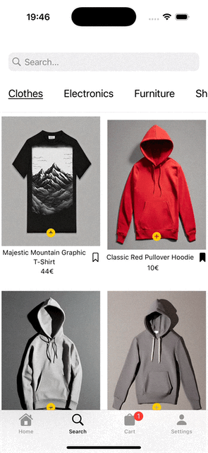

# Fast-Shop

**Dein schneller Weg zum Shopping**

Fast-Shop ist die ideale Lösung für alle, die schnell und unkompliziert Mode, Elektronik und Lifestyle-Produkte einkaufen möchten. Die App richtet sich an Menschen, die Wert auf Stil, Qualität und Effizienz legen – ohne dabei stundenlang nach den passenden Artikeln suchen zu müssen. Fast-Shop vereinfacht den gesamten Einkaufsprozess durch eine benutzerfreundliche Oberfläche und intelligente Filter, mit denen die gewünschten Produkte schnell gefunden werden.

Im Gegensatz zu anderen Plattformen setzt Fast-Shop auf maximale Einfachheit und Geschwindigkeit: Keine unnötigen Schritte, sondern ein Einkaufserlebnis, das sich auf das Wesentliche konzentriert. Ob stylische Kleidung, leistungsstarke Laptops, Gaming-Controller, Mountainbikes oder exklusive Parfums – Fast-Shop bietet eine vielseitige Auswahl und macht Shopping schnell, bequem und stressfrei.
   

  <!-- -->
     
     
    

## Features
<!-- Hier kommen alle Features rein, welche deine App bietet. -->

- [x] Schnellfilter
- [x] Favoresierung
- [x] Intelligente Suchfunktion
- [x] Warenkorb-Erinnerungen

## Technischer Aufbau

Das Projekt verwendet Swift und basiert auf der MVVM-Architektur (Model-View-ViewModel).

• <b>Models:</b> 
Enthält die Datenstrukturen und Klassen, die direkt mit der lokalen MockAPI (basierend auf der Platzi Fake Store API) und der Firebase Firestore-Datenbank interagieren.

• <b>Views:</b> 
Beinhaltet alle SwiftUI-Views, die die Benutzeroberfläche darstellen. Jede View ist schlank und bezieht ihre Daten direkt aus dem entsprechenden ViewModel.

• <b>ViewModels:</b> 
Verarbeitet Daten aus dem Model und bereitet sie für die Views auf.
Enthält die Geschäftslogik und steuert die Kommunikation zwischen View und Model.

• <b>Repositories:</b> 
Dient als Abstraktionsschicht für Datenzugriffe. Koordiniert die Kommunikation zwischen der MockAPI und Firebase Firestore, um eine stabile und zuverlässige Datenquelle zu gewährleisten.

• <b>Client:</b> 
Beinhaltet die API-Schnittstellen und Netzwerkanfragen zur lokalen MockAPI sowie die Firebase-Datenbankkonfiguration.
 

Für die Datenspeicherung wird <b>Firebase Firestore</b> verwendet, eine flexible, cloudbasierte NoSQL-Datenbank.

Warum Firebase Firestore?
  
• <b>Offline-First:</b> 
Daten werden lokal zwischengespeichert und bei Verbindung synchronisiert.

• <b>Echtzeit-Updates:</b> 
Änderungen an Daten werden in Echtzeit auf alle Geräte übertragen.

•Einfach zu integrieren:
• <b>Einfach zu integrieren:</b> 
Dank der Firebase SDK-Unterstützung für Swift.

Gespeicherte Daten
<b>Benutzerdaten:</b> 
•Profilinformationen wie Name und E-Mail-Adresse.
•Favorisierte Produkte (Wunschliste).

<b>Produktinformation:</b> 
•Caching von abgerufenen Produktdetails (z. B. Preis, Beschreibung).

<b>Einstellungen:</b> 
•Benutzerpräferenzen (z. B. Sortierung, Anzeigeoptionen).

Die App verwendet eine eigene MockAPI, die auf Basis der [Platzi Fake Store API](https://fakeapi.platzi.com/en/rest/products/) erstellt wurde .
Da die öffentliche API frei zugänglich ist und häufig durch andere Nutzer verändert oder gelöscht wurde, wurde eine eigene, stabile MockAPI implementiert. Diese stellt die gleichen Endpunkte bereit, jedoch mit kontrollierten und unveränderlichen Daten.

Verwendete Endpunkte der MockAPI:
<b>Verwendete Endpunkte der MockAPI:</b> 

•GET /products – Ruft alle Produkte ab.
•GET /products/{id} – Ruft detaillierte Informationen zu einem Produkt ab.
•GET /categories – Ruft die verfügbaren Kategorien ab.
•GET /products/category/{category} – Ruft Produkte einer bestimmten Kategorie ab.

Die Daten der MockAPI werden im Repository abgefragt und im ViewModel verarbeitet, bevor sie an die View weitergegeben werden.

Warum eine eigene MockAPI?

✅ Stabilität – Keine unerwarteten Änderungen durch externe Nutzer.
✅ Zuverlässigkeit – Konsistente Produktdaten für Tests und Entwicklung.
✅ Flexibilität – Möglichkeit zur Anpassung der API-Struktur für zukünftige Erweiterungen.

#### 3rd-Party Frameworks
• <b>FirebaseAuth:</b> 
Für die Benutzer-Authentifizierung (z. B. Anmeldung mit E-Mail).
	

## Ausblick

- [ ] Mehrere Markenklammotten mit einbringen
- [ ] Mehrere Zahlungsmöglichkeiten einbinden
- [ ] One-Click-Bestellung für wiederkehrende Käufer
- [ ] Wunschlisten teilen mit Freunden oder Familie
- [ ] ...
